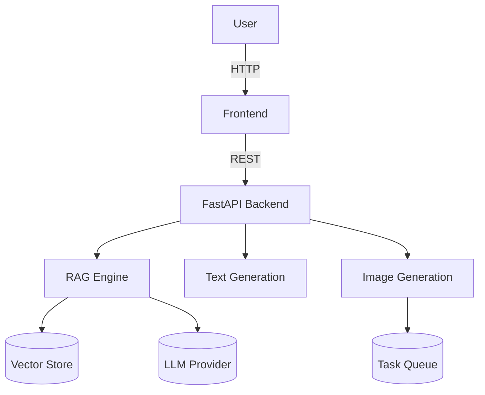

# System Architecture

> **This is a graded deliverable.** Replace every `_TODO_` below with your actual,
> final design. Do not leave template placeholder text in your submission.

## 1. Overview

_TODO: 2–3 paragraphs. What does the system do, who is it for, what are the three
modalities and how do they share infrastructure (config, logging, auth)?_

## 2. High-Level Diagram

_TODO: replace with your real architecture diagram (image or mermaid) reflecting
what you actually built — including any services you added/removed relative to the
starter scaffold (e.g. did you add Celery? a caching layer? a different vector DB?)._

## 3. Component Breakdown

### 3.1 RAG Engine
_TODO: chunking strategy chosen and why, embedding model, vector DB choice and
why, retrieval algorithm (top-k, reranking?), how context is assembled into the
LLM prompt._

### 3.2 Text Generation
_TODO: base model, fine-tuning method (full fine-tune vs. LoRA/PEFT), dataset used,
prompt template design, how diversity/temperature controls are exposed._

### 3.3 Image Generation
_TODO: diffusion model/version, prompt optimization approach, editing features
implemented (inpainting/style transfer), how the generation queue works and why
(latency, GPU contention, cost)._

### 3.4 Backend API
_TODO: auth scheme, rate-limiting strategy and limits chosen, how async/queued
requests are handled, structured logging approach._

### 3.5 Frontend
_TODO: framework choice (Streamlit vs Gradio) and why, how the 3 modalities are
organized in the UI, error/loading states._

## 4. Data Flow

_TODO: walk through one request of each type (QA, writing, image) end-to-end,
listing each hop and what data crosses it._

## 5. Scalability & Failure Modes

_TODO: what happens under load? What's the current bottleneck? What would you do
differently at 10x traffic? What happens when the LLM provider or diffusion
service is down — is there a graceful degradation path?_

## 6. Key Design Trade-offs

_TODO: at least 3 decisions where you chose X over Y and why (e.g. LanceDB over
Pinecone, Streamlit over Gradio, LoRA over full fine-tuning)._

## 7. What You'd Do Differently

_TODO: honest retrospective — 3–5 bullets._
